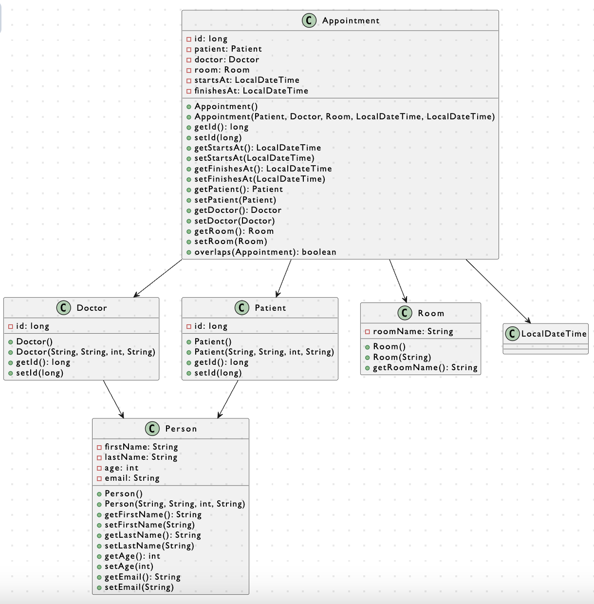

<p align="center"></p>

## Presentación Developer

Paloma Babot León<br>
Cross Functional Full Stack Developer <br>
Github: [https://github.com/Uxoa](https://github.com/Uxoa)<br>
Linkedin: [https://www.linkedin.com/in/palomababot/](https://www.linkedin.com/in/palomababot/)<br>
Teléfono: +34655014845<br>

## Contexto del reto:

Recientemente varios hospitales de la zona han recibido una serie de ataques informáticos y se ha propuesto renovar el sistema de control de citas en el hospital AccWe, ya que es lo que más tiempo lleva sin actualizarse. Los desarrolladores han salvado parte del proyecto anterior y lo han limpiado para evitar posibles errores, actualizando sobre todo librerías. Tu tarea será implementar, arreglar y desarrollar las diferentes necesidades del hospital en cuanto a la gestión de citas.

## Tabla de Contenidos

- [Objetivos](#objetivos)
- [Configuración del Proyecto](#configuración-del-proyecto)
- [Desarrollo del reto](#desarrollo-del-reto)
- [Tests JUnit](#tests-junit)
- [Despliegue con Docker](#despliegue-con-docker)
- [Diagrama UML](#diagrama-uml)


## Objetivos:

1. **Implementación de la Creación de Citas a través de la API:** 
Desarrollar la funcionalidad para generar citas mediante la API, considerando las limitaciones y especificaciones proporcionadas. Este proceso se lleva a cabo en el archivo AppointmentController.java.

2. **Desarrollo de Pruebas JUnit para Entidades y Controladores:** 
Crear pruebas JUnit para cada entidad en el archivo EntityUnitTest.java y para cada controlador en el archivo EntityControllerUnitTest.java.

3. **Mantenimiento del Código Limpio:** 
Verificar que el código esté libre de errores y vulnerabilidades, adhiriéndose a prácticas de código limpio y estándares de seguridad.

4. **Implementación de Despliegue Escalable con Docker y Kubernetes:** 
Elaborar Dockerfiles para ejecutar una base de datos MySQL y el microservicio. Los Dockerfiles se denominan Dockerfile.mysql y Dockerfile.maven, respectivamente.

5. **Creación de un Diagrama UML:** 
Elaborar un diagrama UML que ilustre todas las relaciones entre clases.


## Configuración del Proyecto

Para configurar el proyecto en tu máquina local, sigue estos pasos:

### Requisitos Previos

Antes de comenzar, asegúrate de tener instalados los siguientes requisitos previos en tu sistema:

:point_right: Java Development Kit (JDK) - [Descargar e Instalar](https://www.oracle.com/java/technologies/javase-downloads.html) <br>
:point_right: Maven - [Descargar e Instalar](https://maven.apache.org/download.cgi) <br>
:point_right: Docker - [Descargar e Instalar](https://www.docker.com/get-started) <br>

### Pasos de Configuración

1. **Clonar el Repositorio:**
   Clona este repositorio en tu máquina local utilizando el siguiente comando:

   ```bash
   git clone https://github.com/nuwe-reports/65440cc6d5cf487725805990.git

2. **Instalar dependencias:**

cd nombre-del-proyecto
mvn clean install


## Desarrollo del reto

### Creación de Citas

En `AppointmentController.java` el endpoint (`POST /api/appointment`) permite a los usuarios crear una nueva cita en el sistema realizando ciertas validaciones para que no se superpongan o se repitan. Si todo es correcto, la cita se guarda en la base de datos. 

1. **Validación de la Fecha:**
   - Verifica que la fecha de inicio no sea igual a la fecha de fin. Si son iguales, se devuelve un código de estado `400 Bad Request` indicando una solicitud incorrecta.

2. **Validación de Superposición:**
   - Consulta a la base de datos en busca de citas existentes. Verifica si la nueva cita se superpone con alguna de las citas existentes. Si hay superposición, se devuelve un código de estado `406 Not Acceptable`, indicando que la operación no es aceptable.

3. **Guardar la Cita:**
   - Si las validaciones son exitosas, la nueva cita se guarda en la base de datos utilizando el repositorio de citas (`appointmentRepository.save(appointment)`).

4. **Respuesta Exitosa:**
   - Se devuelve una respuesta con un código de estado `200 OK` junto con los detalles de la cita recién creada.

**Notas:**
Me he asegurado de revisar la estructura y validaciones en la clase `Appointment.java` para entender completamente cómo se modelan y validan las citas en este sistema.

En el controlador `AppointmentController.java`, el método createAppointment maneja la creación de citas mediante solicitudes POST. Se realizan las validaciones para asegurar la coherencia de los datos, evitando duplicados y superposiciones. Si todo está correcto, la cita se guarda en la base de datos. Este enfoque garantiza la integridad de los datos antes de su almacenamiento.


## Tests JUnit
Ejecutar el test: 
```git
mvn test
```

## Test de Entidades

#### Descripción Resumida:

Este conjunto de tests unitarios aborda los aspectos esenciales de persistencia y operaciones de manipulación para las entidades Doctor, Patient, Room y Appointment en un entorno de persistencia. Además, se incluyen pruebas específicas para verificar el correcto funcionamiento de las relaciones entre estas entidades.

##### Configuración (SetUp):

Se inicializan instancias de Doctor, Patient, Room y Appointment para su uso en las pruebas. Se crean tres citas (a1, a2, a3) asociadas al mismo doctor, paciente y sala pero con horarios diferentes.

##### Doctor Tests:

- **should_persist_and_retrieve_doctor_correctly:** Verifica la correcta persistencia y recuperación de un doctor en la base de datos.
- **should_update_doctor_correctly:** Asegura que los detalles del doctor se actualicen correctamente en la base de datos.
- **should_delete_doctor_correctly:** Confirma la eliminación exitosa de un doctor y verifica que no pueda ser recuperado después de la eliminación.
- **should_throw_exception_for_long_firstname:** Verifica que se lance una excepción al intentar persistir un doctor con un nombre excesivamente largo.
- **should_throw_exception_for_long_lastname:** Verifica que se lance una excepción al intentar persistir un doctor con un apellido excesivamente largo.
- **should_throw_exception_for_long_email:** Verifica que se lance una excepción al intentar persistir un doctor con un correo electrónico excesivamente largo.
- **should_persist_appointment_with_doctor:** Asegura que la cita se persista correctamente con el doctor asociado y que la asociación sea válida.
- **should_update_doctor_in_appointment:** Verifica que el cambio de doctor en una cita se refleje correctamente en la base de datos.
- **should_delete_doctor_when_appointment_is_deleted:** Confirma que al eliminar una cita, el doctor asociado también se elimina correctamente.
- **should_not_delete_associated_appointments_when_doctor_is_deleted:** Asegura que al intentar eliminar un doctor, las citas asociadas no se eliminen.

#### Patient Tests:

- **should_persist_and_retrieve_patient_correctly:** Verifica la correcta persistencia y recuperación de un paciente en la base de datos.
- **should_update_patient_correctly:** Asegura que los detalles del paciente se actualicen correctamente en la base de datos.
- **should_delete_patient_correctly:** Confirma la eliminación exitosa de un paciente y verifica que no pueda ser recuperado después de la eliminación.
- **should_throw_exception_for_long_patient_firstname:** Verifica que se lance una excepción al intentar persistir un paciente con un nombre excesivamente largo.
- **should_throw_exception_for_long_patient_lastname:** Verifica que se lance una excepción al intentar persistir un paciente con un apellido excesivamente largo.
- **should_throw_exception_for_long_patient_email:** Verifica que se lance una excepción al intentar persistir un paciente con un correo electrónico excesivamente largo.
- **should_persist_appointment_with_patient:** Asegura que la cita se persista correctamente con el paciente asociado y que la asociación sea válida.
- **should_update_patient_in_appointment:** Verifica que el cambio de paciente en una cita se refleje correctamente en la base de datos.
- **should_delete_patient_when_appointment_is_deleted:** Confirma que al eliminar una cita, el paciente asociado también se elimina correctamente.
- **should_not_delete_associated_appointments_when_patient_is_deleted:** Asegura que al intentar eliminar un paciente, las citas asociadas no se eliminen.

#### Room Tests:

- **should_persist_and_retrieve_room_correctly:** Verifica la correcta persistencia y recuperación de una sala en la base de datos.
- **should_delete_room_correctly:** Confirma la eliminación exitosa de una sala y verifica que no pueda ser recuperada después de la eliminación.
- **should_throw_exception_for_long_room_name:** Verifica que se lance una excepción al intentar persistir una sala con un nombre excesivamente largo.
- **should_persist_appointment_with_room:** Asegura que la cita se persista correctamente con la sala asociada y que la asociación sea válida.
- **should_update_room_in_appointment:** Verifica que el cambio de sala en una cita se refleje correctamente en la base de datos.
- **should_not_delete_associated_appointments_when_room_is_deleted:** Asegura que al intentar eliminar una sala, las citas asociadas no se eliminen.
- **should_delete_room_when_appointment_is_deleted:** Confirma que al eliminar una cita, la sala asociada también se elimina correctamente.

#### Appointment Tests:

- **should_persist_and_retrieve_appointment_correctly:** Verifica la correcta persistencia y recuperación de una cita en la base de datos.
- **should_update_appointment_correctly:** Asegura que los detalles de la cita se actualicen correctamente en la base de datos.
- **should_delete_appointment_correctly:** Confirma la eliminación exitosa de una cita y verifica que no pueda ser recuperada después de la eliminación.
- **should_overlap_when_appointments_start_at_same_time:** Verifica que dos citas se solapen correctamente cuando comienzan al mismo tiempo.
- **should_overlap_when_appointments_end_at_same_time:** Verifica que dos citas se solapen correctamente cuando terminan al mismo tiempo.
- **should_overlap_when_one_appointment_starts_before_and_ends_during_another:** Verifica que dos citas se solapen correctamente cuando una comienza antes y termina durante la otra.
- **should_overlap_when_one_appointment_starts_during_and_ends_after_another:** Verifica que dos citas se solapen correctamente cuando una comienza durante y termina después de la otra.
- **should_not_overlap_when_appointments_are_in_different_rooms:** Asegura que dos citas no se solapen si pertenecen a salas diferentes.
- **should_not_overlap_when_appointments_do_not_overlap_at_all:** Asegura que dos citas no se solapen si no tienen ningún solapamiento.
- **should_not_overlap_when_appointment_finishes_before_this_starts:** Asegura que dos citas no se solapen si una termina antes de que comience la otra.
- **should_not_overlap_when_appointment_starts_after_this_finishes:** Asegura que dos citas no se solapen si una comienza después de que termine la otra.

### Tests de Controladores

A continuación se presentan los tests unitarios para cada uno de los controladores de las entidades principales del sistema: Doctores, Pacientes y Salas.

**Descripción Resumida:**

Este conjunto de tests unitarios abarca los controladores esenciales del sistema hospitalario: Doctores, Pacientes y Salas. Cada sección del código está diseñada para evaluar diversas operaciones clave, asegurando un comportamiento correcto y consistente de los controladores.

**DoctorControllerUnitTest:**
- **shouldGetAllDoctors:** Verifica la obtención de todos los doctores y sus detalles.
- **shouldGetZeroDoctors:** Asegura el manejo adecuado cuando no hay doctores disponibles.
- **shouldGetDoctorById:** Evalúa la obtención de un doctor por su ID específico.
- **shouldNotGetDoctorById:** Confirma el manejo de la falta de un doctor por un ID inexistente.
- **shouldCreateDoctor:** Comprueba la creación exitosa de un nuevo doctor.
- **shouldDeleteDoctorById:** Asegura la eliminación de un doctor específico por ID.
- **shouldNotDeleteDoctorById:** Verifica el manejo cuando se intenta eliminar un doctor inexistente.
- **shouldDeleteAllDoctors:** Evalúa la eliminación de todos los doctores en la base de datos.

#### PatientControllerUnitTest:

- **shouldGetAllPatients:** Garantiza la obtención de todos los pacientes y sus detalles.
- **shouldGetNoPatients:** Maneja correctamente la ausencia de pacientes en la base de datos.
- **shouldGetPatientById:** Evalúa la obtención de un paciente por su ID específico.
- **shouldNotGetPatientById:** Confirma el manejo de la falta de un paciente por un ID inexistente.
- **shouldCreatePatient:** Comprueba la creación exitosa de un nuevo paciente.
- **shouldDeletePatientById:** Asegura la eliminación de un paciente específico por ID.
- **shouldNotDeletePatientById:** Verifica el manejo cuando se intenta eliminar un paciente inexistente.
- **shouldDeleteAllPatients:** Evalúa la eliminación de todos los pacientes en la base de datos.

#### RoomControllerUnitTest:

- **shouldGetAllRooms:** Garantiza la obtención de todas las salas y sus detalles.
- **shouldGetNoRooms:** Maneja correctamente la ausencia de salas en la base de datos.
- **shouldGetRoomByRoomName:** Evalúa la obtención de una sala por su nombre específico.
- **shouldNotGetRoomByRoomName:** Confirma el manejo de la falta de una sala por un nombre inexistente.
- **shouldCreateRoom:** Comprueba la creación exitosa de una nueva sala.
- **shouldDeleteRoomByRoomName:** Asegura la eliminación de una sala específica por nombre.
- **shouldNotDeleteRoomByRoomName:** Verifica el manejo cuando se intenta eliminar una sala inexistente.
- **shouldDeleteAllRooms:** Evalúa la eliminación de todas las salas en la base de datos.

Estas pruebas no solo garantizan la funcionalidad básica sino también escenarios más complejos, asegurando la integridad y confiabilidad de los controladores en diversas situaciones.

## Despliegue con Docker

Se ha completado la implementación para despliegue escalable de la API. Para lograrlo, se creó un Dockerfile Multistage que permite ejecutar una base de datos MySQL y el microservicio. 

Los Dockerfiles se nombraron como sigue:

- **Dockerfile.mysql:** Configurado para ejecutar una instancia de la base de datos MySQL. Para construir la imagen Docker a partir del Dockerfile.mysql, utiliza el siguiente comando:

```bash
docker build -t nombre_imagen_mysql -f Dockerfile.mysql .
```

- **Dockerfile.maven:** Diseñado con un enfoque Multistage. En la primera etapa, se ejecutan las pruebas del microservicio. Si todas las pruebas son exitosas, se procede a compilar y ejecutar el microservicio en la segunda etapa. Para construir la imagen Docker a partir del Dockerfile.maven, utiliza el siguiente comando:

```bash
docker build -t nombre_imagen_maven -f Dockerfile.maven .
```

Este enfoque garantiza un despliegue seguro y eficiente, asegurando que el microservicio se implemente solo cuando todas las pruebas han sido superadas con éxito.

## Diagrama UML:

<p align="center"> </p>

